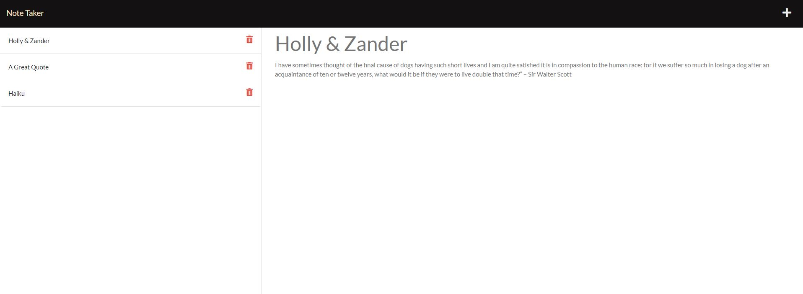

# Expresso Note Taker 


  ## Description
  The Expresso Note Taker features Express.js back end and retrieves note data from a JSON file. I modified starter code to create the Note Taker application that can be used to write and save notes. 

  The application’s front end was already created and I made minor customizations to it to add some personality. I built the back end, connected the two, and then deployed the entire application to Heroku.

  ### Link to Application on Heroku 
  [Expresso Note Taker](https://desolate-springs-12268.herokuapp.com/)

  ### Link to Application Files on GitHub 
  [Expresso Note Taker](https://github.com/NDaruwalla/Expresso-Note-Taker)

  ### Screen Capture
  Landing Page
  

  Notes Page
  


  ## Table of Contents
  - [Description](#description)
  - [User Story/Stories](#story)
  - [Acceptance Criteria](#criteria)
  - [Tools](#tools)
  - [Installation](#installation)
  - [Use](#use)
  - [License](#license)
  - [Contributors](#contributors)
  - [References](#references)
  - [Tests](#tests)
  - [Questions](#questions)

  ## User Story/Stories
  ```md
  AS A small business owner
  I WANT to be able to write and save notes
  SO THAT I can organize my thoughts and keep track of tasks I need to complete
  ```

  ## Acceptance Criteria
  ```md
  GIVEN a note-taking application
  WHEN I open the Note Taker
  THEN I am presented with a landing page with a link to a notes page
  WHEN I click on the link to the notes page
  THEN I am presented with a page with existing notes listed in the left-hand column, plus empty fields to enter a new note title and the note’s text in the right-hand column
  WHEN I enter a new note title and the note’s text
  THEN a Save icon appears in the navigation at the top of the page
  WHEN I click on the Save icon
  THEN the new note I have entered is saved and appears in the left-hand column with the other existing notes
  WHEN I click on an existing note in the list in the left-hand column
  THEN that note appears in the right-hand column
  WHEN I click on the Write icon in the navigation at the top of the page
  THEN I am presented with empty fields to enter a new note title and the note’s text in the right-hand column
  ```

  ## Tools
  The tools used to create this application include: Visual Studio Code, Express.js, JavaScript, Heroku, Git Bash

  ## Installation

  * [Node JS](https://nodejs.org/en/download/)
  * [Express.js](https://expressjs.com/)
  * [Get a free Heroku account:](https://signup.heroku.com/)
  * [Heroku Installer](https://devcenter.heroku.com/articles/heroku-cli#download-and-install)

  ## Use
  Use this application for taking notes. It is hosted at Heroku here: [Expresso Note Taker](https://x)
  To launch, open your terminal and run node server.js. Then open a browser and enter localhost:8080.

  ## How it Works
  The application has a `db.json` file on the back end that is used to store and retrieve notes using the `fs` module.

  The following HTML routes were created:

    * `GET /notes` returns the `notes.html` file.

    * `GET *` returns the `index.html` file.

  The following API routes were created:

    * `GET /api/notes` reads the `db.json` file and returns all saved notes as JSON.

    * `POST /api/notes` receives a new note to save on the request body, adds it to the `db.json` file, and then returns the new note to the client. Each note has a unique id when it's saved (this was possible using the ___`npm` package).


  ## License
  MIT
  
  [](https://opensource.org/licenses/MIT)  Click badge for license description.
  
  ## Contributors
  Nicole Daruwalla 

  ## References
  The following references were used to create this application: 
  * Mini UNH Fullstack Bootcamp mini activity 05/15/21
  * https://www.npmjs.com/
  * https://expressjs.com/en/guide/routing.html
  * https://expressjs.com/en/starter/basic-routing.html
  * https://expressjs.com/en/starter/hello-world.html
  * https://docs.npmjs.com/
  * others as noted in the code comments


  ## Tests
  No tests are included at this time.

  ## Questions
  If you have questions or need help with this application:

  Contact me on GitHub:
  [ndaruwalla](https://github.com/ndaruwalla)
 
  Or, via [Email](mailto:nicole.daruwalla@gmail.com)
